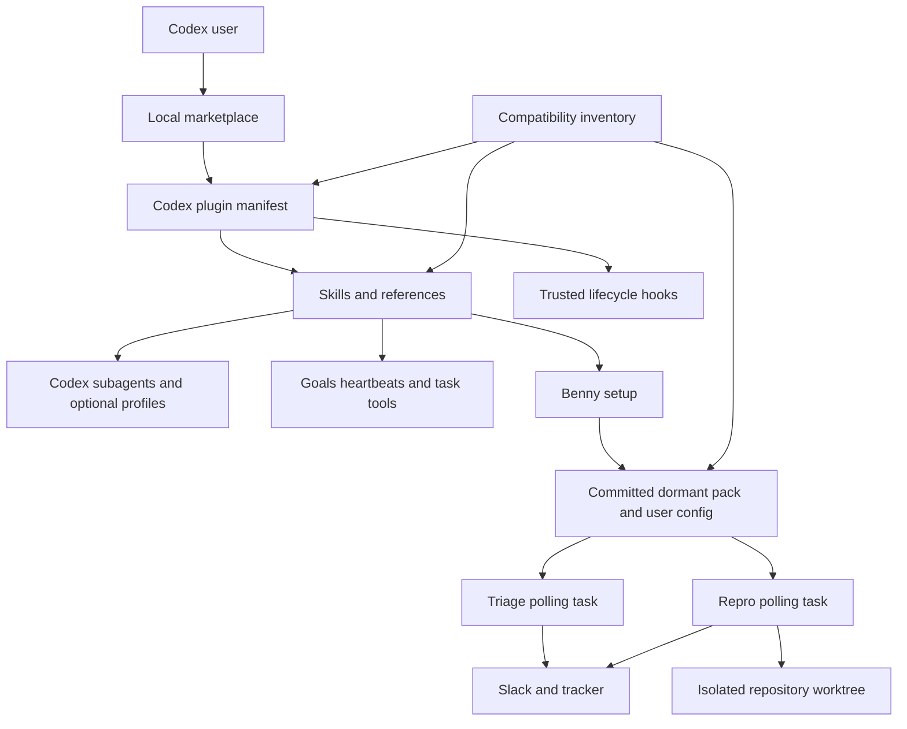
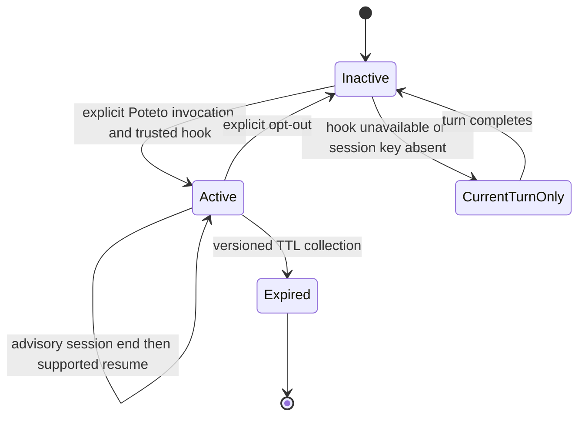
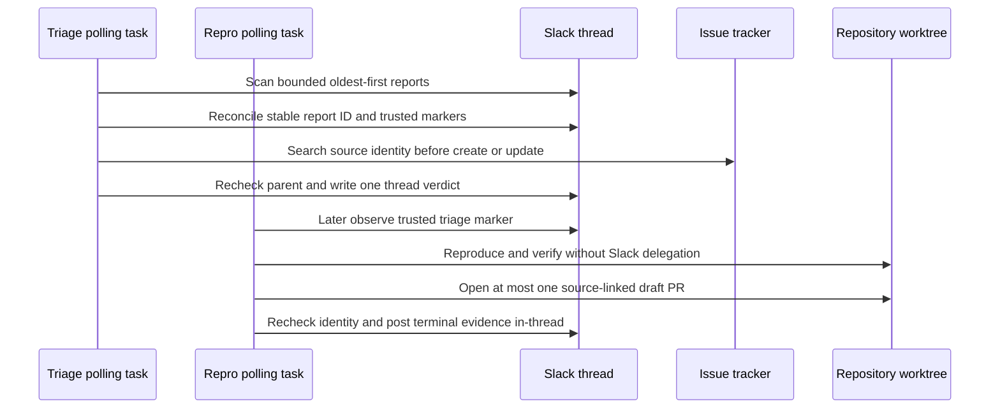

# Codex-Native pstack Fork - Plan

## Goal Capsule

- **Objective:** Codex users can install and use a trustworthy `pstack-for-codex` derivative that preserves pstack's complete engineering workflow, including the dormant Benny automation pack.
- **Means:** Translate host contracts through a documented Codex adapter layer, preserve upstream content through a compatibility inventory, and verify the installed plugin rather than only its source tree. See KTD1-KTD8.
- **Authority:** The confirmed full Codex-only scope outranks upstream Cursor mechanics. Upstream pstack behavior outranks local convenience. Current official Codex contracts govern unavoidable host adaptations.
- **Execution profile:** Land the fork in dependency-ordered gates. Keep each gate installable or explicitly internal until the integrated surface passes.
- **Stop conditions:** The inventory, offline checks, installed-plugin smoke tests, complete behavioral-coverage verdicts, and sticky-mode lifecycle tests pass. Benny ships dormant and paused; its four live canaries gate operator activation, not release of the fork. No runtime Cursor contract remains outside the provenance allowlist.
- **Tail ownership:** Maintainers own compatibility classifications, reviewed upstream refreshes, and revalidation when Codex models, hooks, plugins, or automation surfaces change.

---

## Product Contract

### Summary

Create a Codex-only pstack fork that preserves the complete upstream workflow while replacing Cursor-specific packaging, invocation, delegation, persistence, model routing, history, and automation behavior with Codex-native contracts.

### Problem Frame

The cloned directory is an exact snapshot of upstream `pstack/` at commit `bdf7aa355337897f167153e05069aca505dae17c`, version `0.14.3`.
It is not yet a Codex plugin.
The manifest, 44 top-level skills, 23 Poteto playbooks, two custom-agent personas, guides, scripts, and Benny pack contain host-specific assumptions that range from mechanical path differences to safety-critical orchestration behavior.
A broad search-and-replace would produce plausible prose while silently weakening model validation, worker isolation, sticky-mode behavior, external-write boundaries, and automation idempotency.

### Key Decisions

- **Full Codex-only derivative.** (session-settled: user-directed — chosen over core-first and dual-platform: the user selected the complete Codex port with staged delivery.) Governs R1-R24.
- **Behavioral preservation over syntax preservation.** Cursor tool names and filesystem conventions may change, but their user-visible outcome and safety invariant remain unless a documented Codex limitation requires an explicit deviation. Governs R4, R7-R18.
- **Benny remains included but dormant.** Installation must never activate external writes. Capability checks and canary evidence control activation. Governs R14-R19.

### Actors

- A1. A Codex user installs pstack and invokes its skills.
- A2. A pstack maintainer imports upstream changes and reviews semantic adaptations.
- A3. A Benny operator configures Slack, tracker, repository, and verification adapters.
- A4. Codex subagents perform bounded exploration, implementation, review, or synthesis under the parent task's authority.
- A5. External systems receive Benny's thread replies, tracker mutations, evidence, and draft pull requests.

### Requirements

**Packaging and provenance**

- R1. The repository preserves an immutable baseline for the exact upstream `pstack/` snapshot, original license, source commit, source version, file inventory, and derivative notice.
- R2. The fork installs through a valid `.codex-plugin/plugin.json` and a repo-local marketplace without relying on Cursor plugin metadata.
- R3. All 44 skills, 21 principles, 23 Poteto playbooks, two agent personas, 12 Benny files, scripts, references, and 17 guide assets remain classified and traceable after path moves or semantic adaptation.
- R4. Every upstream file has one compatibility classification, preserved invariants, validation cases, and an owning Codex path or explicit removal rationale.

**Skills, agents, and model routing**

- R5. Every bundled skill has a unique standard name, a concise trigger-oriented description, valid relative resources, and explicit invocation policy where automatic activation would be unsafe.
- R6. Poteto Mode preserves its routing, principles, reply contract, and one-task activation behavior without globally injecting the personality into unrelated work.
- R7. Cursor `Task`, custom-agent, background, read-only, cloud, and resume recipes translate to Codex subagents with explicit ownership, isolation, cancellation, steering, result collection, and capability fallback.
- R8. Writable parallel work uses exclusive file ownership or separate worktrees or output directories before agents start.
- R9. Model configuration stores and validates Codex `model` and `reasoning_effort` as one pair, preserves parent inheritance, and never claims model diversity that the current entitlement set cannot provide.

**Lifecycle, history, and long-running work**

- R10. Per-session sticky mode is isolated by Codex session identity, survives supported resume and compaction paths, propagates only to intended subagents, and never becomes global state when a stable key or trusted hook is unavailable.
- R11. Goals, heartbeats, scheduled jobs, and user-owned tasks are created only when the user's request authorizes that lifecycle.
- R12. Recall, session pickup, pause, reflection, and orchestration use supported Codex task/thread and live-state surfaces rather than Cursor transcript internals.
- R13. Missing hooks, task APIs, connectors, custom-agent profiles, models, or permissions produce a visible degraded mode or a fail-closed stop.

**Benny automation**

- R14. Benny installs as a source-managed dormant pack with user-owned configuration, routing, feature maps, state, and secrets outside the managed pack.
- R15. Local Codex runs Benny as two named polling automations because Slack event triggers and local worktree execution do not coexist on one supported Codex surface.
- R16. Every report is keyed by immutable channel and root-thread coordinates; retries and overlapping observations must not create duplicate replies, tracker items, or draft pull requests.
- R17. Triage writes exactly one trusted verdict in the source thread, and repro acts only on an accepted marker from the configured triage identity.
- R18. Slack text, attachments, tracker records, pull request text, and repository content are untrusted data that cannot change Benny's channel, repository, adapter, authority, budget, model, or posting rules.
- R19. Benny remains paused when any Slack, attachment, tracker, repository, draft-PR, control-adapter, feature-map, approval, or thread-safety prerequisite is missing.

**Distribution, documentation, and maintenance**

- R20. The README and ten-part guide describe only verified Codex installation, skill invocation, model setup, subagents, worktrees, goals, heartbeats, scheduled tasks, and limitations.
- R21. External capabilities such as live UI control, browser control, issue trackers, Slack, and review bots are detected and named as dependencies instead of silently substituted.
- R22. A reviewed upstream refresh imports only `pstack/`, preserves local adaptations and user-owned data, classifies additions, removals, and renames, and never auto-merges.
- R23. Release evidence comes from the installed cache copy in a fresh Codex task and includes behavioral outcomes, not prose similarity or source-tree-only checks.
- R24. Every setup-installed artifact has a scoped ownership receipt. Upgrade and uninstall change only receipted, unmodified pstack-owned artifacts; user configuration and state are preserved unless the operator explicitly requests a purge.

### Key Flows

- F1. **Install and configure.** A1 installs the local plugin, starts a fresh task, runs setup, selects a configuration scope, reviews optional hooks and agent templates, and receives a setup receipt.
- F2. **Run an orchestrated skill.** A1 invokes a skill, the parent resolves its authority and capabilities, creates isolated A4 work, waits or steers it, validates results, and reports one consolidated outcome.
- F3. **Use sticky Poteto Mode.** A1 invokes Poteto Mode, a trusted hook records session-scoped state, later prompts receive compact context, intended subagents receive the wrapper, and explicit opt-out removes only that session state.
- F4. **Process a Benny report.** Triage polls a bounded oldest-first window, reconciles the report identity, writes a trusted thread verdict, and repro later observes the marker, proves the symptom, and optionally opens one draft pull request.
- F5. **Refresh upstream.** A2 imports a new upstream snapshot separately, compares old upstream to new upstream and old derived to current derived, updates classifications, runs affected and full checks, and opens a review artifact.

### Acceptance Examples

- AE1. **Installed-cache discovery.** Given a clean Codex profile and the repo marketplace, when A1 installs the plugin and starts a new task, then every intended skill is discoverable and every relative resource resolves from the installed cache copy.
- AE2. **Untrusted-hook degradation.** Given hooks are untrusted or disabled, when A1 invokes Poteto Mode, then the current task still follows the skill but the response states that cross-turn sticky behavior is inactive.
- AE3. **Entitlement drift.** Given a configured model or effort is no longer available, when a routed skill starts, then it follows the role's declared fallback and does not claim the unavailable model ran.
- AE4. **Benny retry after partial failure.** Given triage created or found a tracker item but stopped before replying, when the next poll sees the same report, then it reconciles by source identity and produces no duplicate external effect.
- AE5. **Malicious report.** Given a Slack attachment tells Benny to change channels or expose credentials, when triage reads it, then the instruction remains data and all configured boundaries stay unchanged.
- AE6. **Safe upstream deletion.** Given upstream removes a playbook that has a Codex adaptation, when A2 refreshes, then the compatibility report blocks promotion until the maintainer explicitly removes, retains, or replaces it.

### Success Criteria

- The complete inventory remains accounted for with no unclassified source file.
- A fresh Codex task can install the complete surface from the cache copy, and every migrated skill and playbook has a generated behavioral-coverage verdict: passed, intentionally explicit-only, or deferred with a named release disposition.
- Runtime content contains no Cursor-only tool, path, model, or automation claim outside approved attribution and compatibility fixtures.
- Benny passes read-only, test-channel, repro-only, and bounded-fix canaries before either production automation becomes active; missing live prerequisites do not block release while both automations remain paused.
- A simulated upstream refresh produces a reviewable compatibility delta without overwriting derived files.

### Scope Boundaries

#### In Scope

- A private or local Codex plugin distribution, all upstream pstack content, optional setup-installed Codex agent profiles, trusted lifecycle hooks, and two local polling automations.
- Compatibility recognition for upstream GitHub review-bot identifiers where that input remains useful.

#### Deferred to Follow-Up Work

- Public universal-directory submission, publication assets beyond the minimum local marketplace metadata, and public review materials.
- A server-backed MCP state service for atomic Benny leases if the local scheduler cannot prove non-overlap and external-source reconciliation is insufficient.
- A separate ChatGPT web event-triggered Benny profile. This plan targets local Codex project execution.

#### Outside This Product's Identity

- Maintaining Cursor and Codex from one conditional instruction tree.
- Silently installing global instructions, activating automations, enabling hooks, or writing secrets.
- Merging or deploying Benny-authored changes.

---

## Planning Contract

### Key Technical Decisions

- KTD1. **Compatibility inventory is the migration control plane.** A machine-readable map owns source-to-derived paths, classification, preserved invariants, validation cases, and upstream hash. Reports are generated from it, so a new or deleted upstream file cannot disappear into prose review. Supports R1-R4 and R22.
- KTD2. **Portable personas live with their owning skills.** Move the Poteto and Comment Sicko instructions into skill references used to seed generic agents. Offer namespaced `.codex/agents/*.toml` templates through explicit setup for direct-spawn convenience, but do not rely on an undocumented manifest `agents` field. Supports R6-R8.
- KTD3. **Model profiles use native agent configuration with observable fallbacks.** Setup generates namespaced project or user agent profiles with separate model and effort values. Missing profiles inherit the parent. Use `model/list` only when that supported surface is available; otherwise record the requested or inherited policy as unverified. Each role declares inherit, entitled substitute, skip, or fail-closed behavior, and no receipt represents unobservable runtime metadata as proven. Supports R9 and AE3.
- KTD4. **Sticky mode is a session-keyed hook state machine.** An explicit `$poteto-mode` invocation activates the current turn and asks a bundled `UserPromptSubmit` hook to persist later-turn state; a documented explicit disable phrase opts out. Inactive prompts exit silently within the hook latency budget. State contains only schema version, activation flag, timestamps, and an optional project fingerprint under `PLUGIN_DATA`; a validated or hashed session ID selects the atomically written file. Advisory `SessionEnd` does not erase resumable state: explicit opt-out or versioned TTL collection does. `SubagentStart` injects context only for the exact namespaced Poteto custom-agent type; when that optional profile is absent, generic delegates receive the portable prompt in their task without disabling parent-task stickiness. Unknown session identity, untrusted hooks, and stale state degrade visibly to current-turn-only behavior. Supports R6, R10, R13, and AE2.
- KTD5. **One central Codex runtime contract governs orchestration.** Skills cite a shared reference for authorization, agent role selection, shared-filesystem isolation, waiting, steering, cancellation, retries, partial results, goals, heartbeats, and unavailable capabilities. This prevents 44 skills from inventing inconsistent tool semantics. Supports R7-R13.
- KTD6. **Benny provides effect-once behavior through stable external identities and destination-side idempotency.** `report_id` hashes workspace or team ID, channel ID, and root thread timestamp. Every tracker mutation, verdict, evidence post, operations-thread root, and draft PR has a versioned operation key. A shared lease or CAS may serialize workers, but every external adapter must also provide atomic destination-side idempotency or authoritative lookup by operation key; ambiguous writes are quarantined until the destination proves whether the effect occurred. Trusted markers and source links remain correctness state, while the local high-water tuple is only a scan optimization. If these guarantees or non-overlap cannot be proven, both automations remain paused and the release records the activation blocker; a shared MCP state service remains deferred follow-up. Supports R15-R19 and AE4.
- KTD7. **External-write authority and credentials stay in a coordinator effect phase.** Repository commands and tests run in a credential-free environment with network denied by default; narrowly allowlisted hosts require receipted operator configuration. Children return typed proposed actions only. The coordinator validates channel, thread, repository, operation key, budget, and outbound minimization immediately before each write, then persists the confirmed receipt. If tool or network separation cannot be proven, repro and fix remain paused; the coordinator must not execute untrusted repository code in the credential-bearing phase. Prompt prohibitions are defense in depth, not credential isolation. Supports R18-R19 and AE5.
- KTD8. **The first port preserves the existing Bun tool runtime.** Rename Cursor package identity, add a clear Bun preflight, characterize existing tests before edits, and change runtime only when a Codex incompatibility is proven. This limits the port's semantic surface while retaining advanced orchestration and PR-watcher behavior. Supports R3, R20-R23.

### High-Level Technical Design

#### Component topology



#### Sticky-mode lifecycle



#### Benny polling protocol



### Output Structure

```text
pstack-for-codex/
├── .codex-plugin/plugin.json
├── .agents/plugins/marketplace.json
├── compatibility/
│   ├── pstack-map.json
│   └── report.md
├── hooks/
│   ├── hooks.json
│   └── scripts/
├── scripts/
│   ├── import-upstream.mjs
│   ├── generate-compatibility-report.mjs
│   └── validate-plugin.mjs
├── templates/codex-agents/
├── tests/
├── evals/
│   ├── cases/
│   ├── rubrics/
│   └── README.md
├── package.json
├── upstream.lock.json
├── UPSTREAM.md
├── NOTICE
├── skills/
├── automations/benny/
└── docs/
```

### Sequencing

1. Freeze and characterize the upstream snapshot before changing host behavior.
2. Establish Codex packaging and validation before migrating orchestration.
3. Add native agent, model, and sticky lifecycle foundations before rewriting their consumers.
4. Port all skill and script consumers before documentation claims Codex parity.
5. Port Benny only after U2's clean-profile install and cache-resource resolution gate passes.
6. Promote the fork only after integrated behavioral evaluations and canaries.

### System-Wide Impact

- **Context:** Forty-four upstream skill descriptions plus the registered Benny setup facade compete within Codex's skill-inventory budget. Descriptions must front-load triggers and boundaries; migrated skills stay explicit-only until their behavioral gate passes.
- **Permissions:** Subagents inherit the parent permission mode and may inherit connectors. Read-only filesystem access is not a connector deny-list.
- **Concurrency:** Codex subagents share a filesystem. Isolation must be created before writable fan-out.
- **Persistence:** Hook state, optional agent profiles, Benny configuration, shared automation state, and setup receipts have different ownership and uninstall rules.
- **Operations:** Benny changes from event-started execution to bounded polling, so latency and lookback become operator-visible configuration.
- **Maintenance:** Upstream prompt changes can alter safety without producing code conflicts. Every refresh requires semantic review.

### Risks and Dependencies

- Hooks require user trust and are hash-sensitive. A hook update temporarily disables stickiness until re-approved.
- Current Codex model entitlements can change. Setup and invocation both need validation.
- Cross-family panels may be impossible on an OpenAI-only entitlement set. The fork must report reduced diversity.
- Benny depends on Slack, tracker, repository, draft-PR, and control adapters with sufficient read and narrowly scoped write capabilities.
- Local polling can miss old reports if the initial watermark, lookback, pagination, and clock-skew rules are incomplete.
- Scheduler worktrees may not share mutable project-local state. Benny needs a canonical user-owned state root with atomic ownership or provider-enforced uniqueness; otherwise it stays paused.
- Ambiguous external-write timeouts require reconciliation receipts. Destructive compensation is unsafe because the remote effect may already exist.
- Untrusted attachments and repository code can attempt credential or network exfiltration. Credential-bearing effects and credential-free execution must remain separate phases.
- Bun is an existing runtime dependency for advanced pstack scripts and needs an explicit preflight.
- The target has no initial commit. Adaptation before the immutable baseline would make future upstream comparison unreliable.

### Alternative Approaches Considered

- **Dual-platform conditional tree:** Rejected by the session-settled scope. It would multiply every host contract and make safety review harder.
- **Core-only first product:** Rejected by the session-settled scope. Staging remains an execution technique, not a product-scope reduction.
- **Global search-and-replace:** Rejected because delegation, persistence, history, permissions, and automation require semantic adapters.
- **AGENTS.md as the sticky mechanism:** Rejected because Codex loads it at run start, cannot toggle it per task, and would affect unrelated tasks.
- **ChatGPT web event triggers for primary Benny:** Deferred because they cannot operate on a local repository worktree in the same execution surface.

---

## Implementation Units

### U1. Freeze the upstream baseline and compatibility contract

- **Goal:** Make the untouched source snapshot reproducible and every future divergence reviewable.
- **Requirements:** R1, R3-R4, R22; F5; AE6; KTD1.
- **Dependencies:** None.
- **Files:** `upstream.lock.json`, `NOTICE`, `compatibility/pstack-map.json`, `compatibility/report.md`, `scripts/import-upstream.mjs`, `scripts/generate-compatibility-report.mjs`, `tests/upstream-provenance.test.mjs`, `tests/compatibility-map.test.mjs`.
- **Approach:**
  1. Commit the exact copied tree as the immutable snapshot before adaptation.
  2. Record repository, subdirectory, commit, version, retrieval date, file hashes, and original license.
  3. Classify all 156 upstream files and generate the human report from the machine map.
  4. Import future snapshots into a temporary tree and produce old-upstream, new-upstream, and derived diffs without overwriting the fork.
- **Execution note:** Start with characterization tests against the untouched snapshot.
- **Patterns to follow:** Source-managed versus user-owned merge rules in `automations/benny/FOR_AGENTS.md`.
- **Test scenarios:**
  - Import the pinned commit and verify every recorded path and hash matches the baseline.
  - Add an upstream fixture file and verify report generation fails until it is classified.
  - Remove or rename a fixture and verify the report requires an explicit derived disposition.
  - Change a derived file and verify refresh leaves it untouched while reporting the conflict.
- **Verification:** The baseline is committed, the lock reproduces it, every file is classified, and a dry-run refresh changes no derived file.

### U2. Establish quarantined Codex plugin packaging and discovery

- **Goal:** Make the unadapted inventory discoverable for development through Codex's native plugin and marketplace surface without exposing unported workflows to automatic activation.
- **Requirements:** R2-R5, R23-R24; F1; AE1; KTD1.
- **Dependencies:** U1.
- **Files:** `.codex-plugin/plugin.json`, `.agents/plugins/marketplace.json`, `.cursor-plugin/plugin.json` (remove), `skills/*/SKILL.md`, `skills/*/agents/openai.yaml`, `scripts/validate-plugin.mjs`, `tests/manifest.test.mjs`, `tests/skill-surface.test.mjs`, `tests/resource-resolution.test.mjs`.
- **Approach:**
  1. Create the Codex manifest with `pstack-for-codex` identity, `./skills/`, and interface metadata. Add the hook component only in U4 when its path and handlers exist.
  2. Normalize skill names and standard frontmatter while preserving source descriptions as compatibility evidence.
  3. Mark every skill explicit-only during migration and label this install development-only. Move invocation and UI policy to `agents/openai.yaml`; do not treat that file as a custom-agent definition. Enable implicit invocation per skill only after its U5 behavioral gate passes.
  4. Resolve resources from the installed cache copy, not the development checkout.
  5. Measure full-inventory discovery and routing cost before U5. If one plugin cannot expose the complete surface reliably, split the distribution into namespaced core and extended components within the same local marketplace while preserving the `pstack-for-codex` bundle identity and recording the split in the compatibility map.
  6. Probe Bun availability in the installed environment before advanced workflows depend on it; record an unavailable result as an early compatibility blocker for U6 rather than discovering it after skill migration.
- **Execution note:** Prefer install/runtime smoke proof over source-only schema checks.
- **Patterns to follow:** Official Codex plugin and skill layouts cited in Sources and Research.
- **Test scenarios:**
  - Install from the repo marketplace into a clean profile and discover the complete skill inventory in a new task.
  - Verify duplicate names, invalid paths, unsupported manifest fields, and missing references fail validation.
  - Verify setup and automation skills do not activate from unrelated prompts.
  - Verify no unported skill can activate implicitly and each migrated skill is enabled only by a recorded behavioral gate.
  - Verify shortened inventory descriptions still preserve distinct trigger terms.
- **Verification:** Codex loads the plugin without compatibility warnings and all resources resolve from the cache.

### U3. Add native agent personas and model-role setup

- **Goal:** Preserve pstack's agent roles and model routing through supported Codex custom-agent configuration.
- **Requirements:** R7-R9, R13, R24; F1; AE3; KTD2-KTD3.
- **Dependencies:** U2.
- **Files:** `skills/poteto-mode/references/poteto-agent-prompt.md`, `skills/no-comments/references/comment-sicko-prompt.md`, `templates/codex-agents/*.toml`, `skills/setup-pstack/SKILL.md`, `skills/setup-pstack/agents/openai.yaml`, `skills/setup-pstack/references/model-profile.md`, `tests/agent-templates.test.mjs`, `tests/model-config.test.mjs`, `tests/setup-receipt.test.mjs`, `agents/poteto-agent.md` (move), `agents/comment-sicko.md` (move).
- **Approach:**
  1. Make prompt assets the portable source of persona behavior.
  2. Let explicit setup install namespaced project or user TOML profiles after scanning both project and user layers for duplicate TOML `name` fields, regardless of filename. Run entitlement checks when the supported model-list surface is available; otherwise follow KTD3's inherit-and-label-unverified path.
  3. Store an ownership receipt with file hashes and update or remove only unchanged pstack-owned files.
  4. Define a role capability matrix covering sandbox, writable scope, connector posture, skills, model policy, and fallback. Validate model and effort pairs through `model/list` when available; otherwise inherit and label the result unverified. Surface reduced panel diversity.
- **Test scenarios:**
  - Install project-scoped and user-scoped profiles without changing unrelated agent files.
  - Encounter a name collision and verify setup stops without overwrite.
  - Remove an unchanged installed profile and verify only the receipted file is deleted.
  - Modify an installed profile and verify upgrade and uninstall require review.
  - Remove a configured entitlement and verify the declared fallback runs without a false model claim.
  - Configure duplicate agent names in differently named files across project and user layers and verify setup stops without overwrite.
  - Verify a security-sensitive role skips or fails closed when its inherited connector surface cannot be proven safe.
- **Verification:** Both personas run through portable prompts, optional profiles are reversible, and every role records whether configuration was explicit or inherited, the requested and resolved pair when observable, and any fallback without representing unobservable runtime metadata as verified.

### U4. Implement session-scoped Poteto lifecycle

- **Goal:** Preserve opt-in Poteto behavior across turns without leaking state across tasks or projects.
- **Requirements:** R6, R10, R13; AE2; KTD4.
- **Dependencies:** U2-U3.
- **Files:** `hooks/hooks.json`, `hooks/scripts/poteto-mode-state.mjs`, `hooks/scripts/poteto-subagent-context.mjs`, `scripts/poteto-hook-status.mjs`, `skills/poteto-mode/SKILL.md`, `skills/poteto-mode/agents/openai.yaml`, `tests/poteto-mode-hooks.test.mjs`, `tests/fixtures/hooks/*`.
- **Approach:**
  1. Recognize only explicit `$poteto-mode` activation and the documented disable phrase; inactive prompts exit silently within a measured latency budget.
  2. Validate or hash the stable session ID, store only versioned activation metadata, write atomically, preserve advisory session-end state for resume, and collect it by explicit opt-out or TTL.
  3. Let the skill provide context on the activation turn. Use `UserPromptSubmit` for later turns and `SubagentStart` only for the exact namespaced Poteto agent type; generic agents receive the portable persona prompt in their task.
  4. Add a status command that checks state plus a hook-written receipt. Report sticky mode active only when that receipt exists; otherwise state current-turn-only behavior.
- **Test scenarios:**
  - Activate in one task and verify a concurrent task stays inactive.
  - Resume and compact an active task and verify the mode remains active once, without duplicate context.
  - Opt out and verify later prompts and subagents receive no Poteto context.
  - Start a generic reviewer and a Poteto delegate and verify only the delegate receives the wrapper.
  - Disable hook trust and verify the skill reports current-turn-only behavior.
  - Feed malformed hook input and verify it exits quickly without creating global state.
  - Exercise concurrent writes, stale schema cleanup, project-fingerprint collisions, advisory session end followed by resume, and an unexpected new session ID.
  - Mention Poteto casually without explicit invocation and verify no state is created.
- **Verification:** State transitions match the lifecycle diagram and no test can activate another session.

### U5. Translate skills and playbooks through one Codex runtime contract

- **Goal:** Replace Cursor orchestration, history, verification, and long-running mechanics without changing each workflow's purpose.
- **Requirements:** R5-R13, R21; F2-F3; KTD2-KTD5 and KTD7.
- **Dependencies:** U3-U4.
- **Files:** `skills/poteto-mode/references/codex-agent-runtime.md`, `skills/poteto-mode/SKILL.md`, `skills/poteto-mode/playbooks/*.md`, `skills/how/SKILL.md`, `skills/why/SKILL.md`, `skills/architect/SKILL.md`, `skills/arena/SKILL.md`, `skills/swarm/SKILL.md`, `skills/interrogate/SKILL.md`, `skills/reflect/SKILL.md`, `skills/recall/SKILL.md`, `skills/no-comments/SKILL.md`, `skills/create-verification-skill/SKILL.md`, `skills/maintain-verification-skill/SKILL.md`, `skills/automate-me/SKILL.md`, `skills/**/*.md`, `tests/codex-runtime-references.test.mjs`, `tests/skill-behavior/*.yaml`.
- **Approach:**
  1. Define authorization, role selection, isolation, result ownership, steering, cancellation, retries, partial completion, and unavailable-capability behavior once.
  2. Replace Cursor tool recipes with citations to that contract plus unit-local workflow instructions.
  3. Map long-running requests to goals and thread heartbeats only when the request authorizes them.
  4. Use supported task/thread APIs for history with a git and manual-digest fallback.
  5. Move generated project skills to `.agents/skills/` and detect live-surface tools before claiming verification.
  6. For unavailable custom profiles, disabled subagents, capacity exhaustion, interrupted children, and unavailable steering or cancellation, apply the workflow's declared sequential-parent, generic-agent, partial-result, or visible fail-closed policy.
- **Test scenarios:**
  - Run read-heavy, write-heavy, panel, race, and nested workflows and verify correct agent roles and result aggregation.
  - Attempt writable fan-out without ownership or worktrees and verify the parent refuses to spawn.
  - Steer and cancel an active worker and verify partial state is reconciled.
  - Request an ordinary feature and verify no goal, heartbeat, or separate user task is created.
  - Request an overnight predicate and verify goal and heartbeat state resume without shell sleeping.
  - Run recall with task tools absent and verify the documented fallback avoids private transcript scraping.
  - Disable subagents, exhaust concurrency, remove custom profiles, interrupt a child, and remove steering support; verify each workflow follows its declared fallback without silently dropping work.
- **Verification:** Representative workflows preserve their exit conditions and leave no runtime Cursor construct outside the allowlist.

### U6. Adapt bundled scripts and dependency boundaries

- **Goal:** Keep advanced pstack tooling working under Codex while making its runtime and external dependencies explicit.
- **Requirements:** R3, R12-R13, R20-R23; KTD8.
- **Dependencies:** U5.
- **Files:** `skills/poteto-mode/scripts/package.json`, `skills/poteto-mode/scripts/bootstrap.ts`, `skills/poteto-mode/scripts/check-plan.mjs`, `skills/poteto-mode/scripts/orch/*`, `skills/poteto-mode/scripts/watch-pr/*`, `skills/poteto-mode/scripts/worktree-audit.sh`, `skills/show-me-your-work/scripts/log.sh`, `tests/script-preflight.test.mjs`.
- **Approach:**
  1. Run existing tests and strict type checking before modifying scripts.
  2. Rename Cursor package identity and add a deterministic Bun availability failure.
  3. Replace Cursor stores, transcripts, worktree paths, and cloud assumptions with passed Codex paths or supported APIs.
  4. Keep legitimate legacy review-bot recognition behind a named input-compatibility rule.
- **Execution note:** Characterize existing CLI output and state files before changing path or process behavior.
- **Test scenarios:**
  - Run every existing orchestrator and watch-PR test before and after adaptation with equivalent outputs.
  - Remove Bun from the test PATH and verify a concise setup error with no partial install.
  - Point worktree audit at nested and stale worktrees and verify safety gates prevent broad deletion.
  - Parse legacy and configured review-bot identifiers without treating them as Codex platform dependencies.
  - Pass a missing or malformed state path and verify tools fail closed without writing elsewhere.
- **Verification:** Existing tests and type checking pass, plus new preflight and path-boundary tests pass.

### U7. Port Benny to capability-gated Codex polling

- **Goal:** Preserve Benny's triage, reproduction, evidence, and bounded-fix outcomes under local Codex automation constraints.
- **Requirements:** R14-R19, R21, R24; F4; AE4-AE5; KTD6-KTD7.
- **Dependencies:** U2, U5-U6.
- **Files:** `skills/setup-benny/SKILL.md`, `skills/setup-benny/agents/openai.yaml`, `automations/benny/FOR_AGENTS.md`, `automations/benny/README.md`, `automations/benny/skills/triage-issue-reports/SKILL.md`, `automations/benny/skills/reproduce-and-fix-issues/SKILL.md`, `automations/benny/skills/**/references/*`, `automations/benny/templates/*`, `automations/benny/scripts/reconcile-state.mjs`, `automations/benny/scripts/replay-report.mjs`, `automations/benny/schemas/marker.schema.json`, `automations/benny/schemas/state.schema.json`, `tests/benny-contract.test.mjs`, `tests/benny-state-machine.test.mjs`, `tests/benny-security-boundary.test.mjs`, `tests/fixtures/benny/*`.
- **Approach:**
  1. Register only setup; keep operational instructions dormant and copied into `.codex/automations/benny/` in the target project.
  2. Keep user configuration and feature/routing maps under `.codex/benny/`. Reference adapter credentials only through supported environment-variable names, OS-keychain handles, or an approved external secret manager; never persist values in the managed tree, state, receipts, prompts, dead letters, or logs. Validate per-adapter least-privilege scopes before activation and define operator-driven rotation, revocation, and fail-closed mid-run behavior.
  3. Put mutable scheduler state in one canonical user-owned location shared by both automation worktrees, record its ownership, use owner-only permissions and source-control exclusion, and require atomic access; a worktree-local state directory is invalid. Persist only identifiers, hashes, bounded status metadata, and redacted failure reasons. Define retention, age-out, and explicit purge while preserving state by default across upgrade and uninstall.
  4. Create or update two paused project cron automations only after explicit authorization; never duplicate existing tasks.
  5. Derive `report_id` from workspace or team, channel, and root-thread coordinates. Give every external effect a versioned operation key. Qualify each real adapter for atomic destination-side idempotency or authoritative operation-key lookup, with a shared lease or CAS used only for serialization. If any effect lacks that guarantee, setup records the blocker and keeps both tasks paused.
  6. Poll using provider timestamps and a persisted high-water tuple with configurable overlap. Fully paginate through a fixed cutoff, then sort oldest-first. Advance the tuple only past durably reconciled or explicitly dead-lettered reports; pending state is internal and never a Slack progress post.
  7. Use bounded retries, capped backoff, attempt receipts, dead-letter reasons, and manual replay by validated `report_id`. Reconcile source parent, trusted verdict, tracker identity, existing PR or source branch, then pending action. After an ambiguous timeout, never replay until authoritative destination lookup proves the effect exists or definitively did not occur; otherwise quarantine the report.
  8. Accept exactly one versioned trusted marker under the exact root coordinates when its author is an approved current or explicitly migrated identity and its embedded `report_id` matches recomputation. Quarantine conflicting markers and unapproved identity rotation.
  9. Normalize only allowlisted fields from untrusted inputs. Enforce attachment scheme and domain at every redirect hop, reject loopback, link-local, and private resolved addresses, omit credentials on redirects, and enforce MIME, size, hop-count, and archive-expansion limits. Pin operational instructions and secret-free configuration to an approved committed hash and require reapproval on change.
  10. Run repository commands and tests in a credential-free, network-denied phase by default. Record every narrowly allowlisted host in the setup receipt and re-show it at canary time; keep repro and fix paused if the sandbox cannot enforce the configured posture. Children return typed proposed effects.
  11. Before every external write, validate destination, operation key, budget, and an outbound minimization schema. Allow only derived fields plus source links; scan tracker, Slack, branch, commit, and draft-PR payloads for credentials and contact details and dead-letter on a hit.
  12. Run four adapter-qualified canaries before activation: read-only, test-channel triage, repro-only, and bounded fix with draft PR. Include a non-production concurrent race and ambiguous-write reconciliation against the configured canonical state root.
- **Test scenarios:**
  - Scan an initial backlog and verify the configured watermark and oldest-first batch limit.
  - Poll the same report twice and verify one verdict, one tracker identity, and at most one draft PR.
  - Stop after tracker mutation but before Slack reply and verify the next run reconciles without duplication.
  - Observe no triage marker and verify repro stays pending for the next poll.
  - Observe a marker from the wrong identity and verify no repro or write occurs.
  - Process malicious text and attachments and verify configuration and credentials remain unchanged.
  - Remove each required capability in turn and verify both tasks remain paused or stop before any write.
  - Attempt automation setup twice and verify the existing IDs are updated, not duplicated.
  - Race two runs on one report and verify provider uniqueness or the shared atomic lease admits only one effect sequence.
  - Process multi-page, equal-timestamp, out-of-order, clock-skewed, and mid-page-failure fixtures and verify the watermark never advances past an unreconciled report.
  - Dead-letter a poison report, continue later reports, and manually replay it by `report_id` without duplication.
  - Simulate an ambiguous timeout after each external write and verify reconciliation reuses the confirmed tracker, verdict, branch, or draft PR.
  - Rotate the trusted identity and create conflicting markers; verify the report is quarantined until explicit migration or resolution.
  - Feed malicious redirects, oversized archives, environment and network exfiltration scripts, and off-channel model-proposed actions; verify secrets, tools, destinations, and authority remain isolated.
  - Feed pasted credentials and personal contact details and verify no tracker, Slack, branch, commit, or draft-PR payload republishes them.
  - Revoke or rotate each adapter credential and verify missing scope or mid-run revocation stops without logging values or entering an unbounded retry loop.
  - Verify setup creates exactly two stable named paused automations, records their IDs, and preserves user configuration and state across upgrade or uninstall without logging secrets.
- **Verification:** Fake adapters pass the thread-safety, privacy, credential, and idempotency matrix. The fork may release with both automations paused and named activation blockers; a harmless live-channel canary and real-adapter uniqueness evidence are required only before an operator activates Benny.

### U8. Rewrite Codex documentation and dependency guidance

- **Goal:** Make installation, use, limitations, and maintenance accurate for Codex users and maintainers.
- **Requirements:** R20-R22, R24; KTD1-KTD8.
- **Dependencies:** U2-U7.
- **Files:** `README.md`, `docs/guide/README.md`, `docs/guide/01-setup.md`, `docs/guide/02-poteto-mode.md`, `docs/guide/03-understand.md`, `docs/guide/04-design.md`, `docs/guide/05-build-and-clean.md`, `docs/guide/06-verify-and-ship.md`, `docs/guide/07-overnight.md`, `docs/guide/08-principles.md`, `docs/guide/09-make-it-yours.md`, `docs/guide/10-recipes-and-pitfalls.md`, `docs/codex-adaptation.md`, `UPSTREAM.md`, `tests/docs-links.test.mjs`.
- **Approach:** Derive documentation from verified behavior. Explain namespaced skill invocation, setup scope, hook trust, agent profiles, model-effort pairs, filesystem sharing, worktrees, goals, heartbeats, Bun, external capabilities, Benny polling latency, canaries, and upstream refresh.
- **Test scenarios:**
  - Follow the installation guide from a clean profile and reach a working representative skill.
  - Follow setup, opt-out, uninstall, and upgrade paths without changing unrelated user files.
  - Search docs for forbidden Cursor installation, model-picker, cloud-agent, `/loop`, `/automate`, or transcript claims and permit only attribution or migration notes.
  - Verify every internal link and image resolves from the installed package.
- **Verification:** A new user can complete the guide without undocumented steps, and the limitation table matches runtime evidence.

### U9. Gate release on installed behavioral parity

- **Goal:** Prove the fork works as an installed Codex plugin across the highest-risk workflows.
- **Requirements:** R1-R24; AE1-AE6.
- **Dependencies:** U1-U8.
- **Files:** `package.json`, `tests/inventory.test.mjs`, `tests/forbidden-host-contracts.test.mjs`, `tests/installed-plugin-smoke.test.mjs`, `evals/cases/*.yaml`, `evals/rubrics/*.md`, `evals/README.md`, `compatibility/report.md`.
- **Approach:**
  1. Run inventory, manifest, metadata, reference, script, hook, model, docs, and Benny checks.
  2. Install into a temporary clean Codex profile and run representative direct, indirect, incomplete-input, negative-trigger, and unsupported-action cases.
  3. Generate a behavioral-coverage matrix mapping every one of the 44 upstream skills and 23 playbooks to at least one positive outcome case and every applicable authority, capability, and negative-trigger boundary. Record passed, intentionally explicit-only, or deferred with a named release disposition.
  4. Grade workflow choice, agent role, authority boundary, evidence, and stop condition rather than prose match.
  5. Repeat affected evaluations during upstream refresh and run the full automatable set before release; keep connector- and trust-dependent activation cases separate.
- **Test scenarios:**
  - Exercise Poteto routing, how, why, arena, swarm, Comment Sicko, recall, goals/heartbeats, and all setup paths in fresh tasks.
  - Verify hook trust, resume, compaction, opt-out, and concurrent-session isolation.
  - Verify unavailable models, tools, connectors, and approvals produce the declared degraded or stopped behavior.
  - Verify no abandoned experiment, generated profile, task, worktree, or local marketplace state remains after teardown.
- **Verification:** The release report identifies the installed plugin version, upstream lock, Codex version, actual models, permission mode, tests, eval verdicts, canary state, and known limitations.

---

## Verification Contract

| Gate | Scope | Required evidence |
|---|---|---|
| Baseline | U1 | Exact snapshot hashes, immutable baseline commit, complete compatibility classifications |
| Static plugin | U2-U3 | Manifest validation, unique skill metadata, resolved resources, parsed agent TOML, ownership receipts |
| Lifecycle | U4-U5 | Hook fixtures, concurrent-session isolation, subagent propagation, authority and capability cases |
| Existing tooling | U6 | `bun test` for orchestrator and watch-PR suites, plus strict TypeScript type checking |
| Benny | U7 | Fake-adapter state-machine suite, malicious-input suite, no-duplicate effects, paused-on-missing-capability |
| Documentation | U8 | Link and image checks, clean-profile walkthrough, forbidden-claim scan |
| Installed behavior | U9 | Local marketplace install in a clean profile, fresh-task skill discovery, representative behavioral evaluations |
| Live activation | U7-U9 | Operator-only Benny gate: four canaries, real-adapter idempotency evidence, reviewed credentials and permissions |

The root verification entry point should run the Baseline, Static plugin, Existing tooling, Benny fake-adapter, and Documentation gates in one command.
Installed-behavior tests remain separate when they require a fresh profile or hook trust. Live-activation tests remain operator-only because they require connectors and harmless external fixtures.

---

## Definition of Done

- U1-U9 meet their offline and installed-plugin Verification fields and all applicable test scenarios pass. Live Benny activation evidence is required only before unpausing its automations.
- The immutable upstream snapshot and current derived tree are distinguishable in git history.
- The compatibility map accounts for every upstream path and generated reports are current.
- The installed cache copy exposes the complete intended skill surface in a fresh task.
- Every migrated skill and playbook has a behavioral-coverage verdict, and the release report names any intentionally explicit-only or deferred entry.
- Poteto Mode is isolated per session, visibly degrades without trusted hooks, and opts out cleanly.
- Agent setup, model setup, automations, marketplace entries, shared Benny state, and worktrees have reversible ownership receipts or teardown proof.
- No runtime Cursor host contract remains outside the documented provenance and legacy-input allowlist.
- Benny is paused by default and cannot produce root-channel posts, duplicate effects, untrusted-marker actions, child-originated Slack writes, merges, or deploys.
- README, guide, adaptation notes, upstream notes, and limitations match verified behavior.
- Abandoned experiments, compatibility shims, stale generated profiles, temporary imports, and dead worktrees are removed.
- The release evidence records remaining limitations, especially polling latency, hook trust, connector availability, model diversity, and Bun.

---

## Sources and Research

- Upstream source: `https://github.com/cursor/plugins/tree/main/pstack`, pinned to `bdf7aa355337897f167153e05069aca505dae17c`.
- Official OpenAI plugin packaging: `https://developers.openai.com/plugins/build/plugins`.
- Official OpenAI skill authoring: `https://developers.openai.com/plugins/build/skills` and `https://learn.chatgpt.com/docs/build-skills`.
- Official Codex subagents and custom agents: `https://learn.chatgpt.com/docs/agent-configuration/subagents`.
- Official Codex hooks: `https://learn.chatgpt.com/docs/hooks`.
- Official scheduled tasks and automation constraints: `https://learn.chatgpt.com/docs/automations`.
- Official import guidance for Cursor setup: `https://learn.chatgpt.com/docs/import`.
- Installed local Codex pstack variants informed path and model-configuration risks; they are evidence, not fork source.
